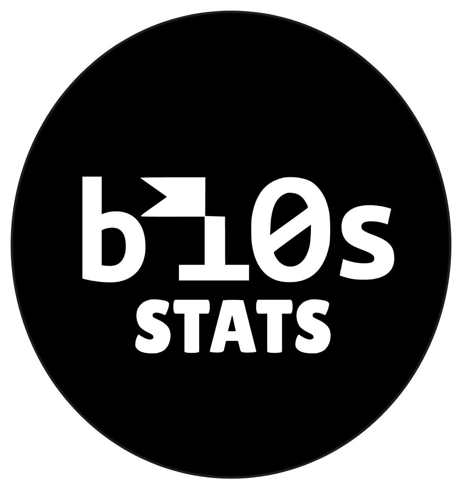

# bi0s Stats

App to check live stats for [team bi0s](bi0s.in).

Huge thanks to [Anikait](https://github.com/br34dcrumb) for helping out with his contributions.

## Install

You can get the stable builds from the [Releases page](https://github.com/sp3p3x/bi0s_stats/releases).

Alternatively, upon every push, a workflow runs which builds an apk. You can download those from the action's artifacts.

["Nightly builds" workflow](https://github.com/sp3p3x/bi0s_stats/actions)

## Run the flutter app

Instructions to run the app from the repo:

```
git clone https://github.com/sp3p3x/bi0s_stats.git
cd bi0s_stats
flutter run
```

## Contributing

Any suggestions, improvements, optimisations are welcome!

```
1) Fork this repo
2) Make the changes
3) Send a PR
```

*PS. The codebase is kinda wack and heavily unoptimised since it was cooked over a few overnights*